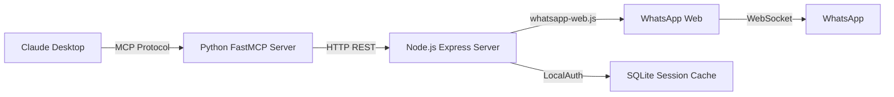

# 💬 WhatsApp MCP Server

<div align="center">

[](https://opensource.org/licenses/MIT)
[](https://nodejs.org/)
[](https://www.python.org/)
[](https://github.com/jlowin/fastmcp)
[](https://github.com/alicenjr/WhatsApp-MCP-Server/stargazers)

**A powerful, lightweight bridge connecting WhatsApp Web to Claude Desktop and other AI assistants via Model Context Protocol (MCP)**

[Features](#-features) • [Quick Start](#-quick-start) • [Architecture](#-architecture) • [API](#-api-reference) • [Integration](#-claude-desktop-integration) • [Contributing](#-contributing)

</div>

---

## 🌟 Overview

WhatsApp MCP Server is a production-ready bridge that seamlessly connects WhatsApp Web to AI assistants like Claude Desktop through the Model Context Protocol. Built with Node.js and Python, it enables AI assistants to send messages, retrieve chat history, and understand conversations through a simple, RESTful interface.

### Why WhatsApp MCP Server?

- **🚀 Zero-Config Setup**: QR-based authentication with automatic session persistence
- **🔒 Local & Secure**: Runs entirely on your machine, no data leaves your computer
- **🤖 AI-Ready**: Built specifically for Claude Desktop and MCP-compatible AI assistants
- **⚡ Lightning Fast**: Optimized Express + whatsapp-web.js architecture
- **🎯 Context-Aware**: Automatically includes conversation context for smarter AI responses
- **🔧 Developer Friendly**: Clean REST API and Python tools for easy integration

---

## ✨ Features

### Core Functionality
- 📤 **Send WhatsApp Messages** - Programmatically send messages to any contact or group
- 📥 **Fetch Chat History** - Retrieve recent messages from any conversation
- 💭 **Conversation Understanding** - Get normalized conversation views with role detection (me/them)
- 🔐 **Session Persistence** - QR scan once, authenticate forever with LocalAuth storage
- 📊 **Context Injection** - Automatically include conversation history for AI context

### Technical Features
- ⚙️ **RESTful HTTP API** - Simple endpoints for integration with any platform
- 🐍 **Python FastMCP Tools** - Pre-built tools for MCP integration
- 🔄 **Phone Number Normalization** - Automatic formatting to WhatsApp IDs
- 👥 **Group Chat Support** - Works with both individual chats and groups
- 🛡️ **Error Handling** - Comprehensive error messages and status codes
- 📦 **Minimal Dependencies** - Lightweight with only essential packages

---

## 🏗️ Architecture



### Components

| Component | Technology | Purpose |
|-----------|-----------|---------|
| **Node.js Server** | Express + whatsapp-web.js | WhatsApp Web client and HTTP API |
| **Python Server** | FastMCP + httpx | MCP tools and AI assistant integration |
| **Session Storage** | SQLite (LocalAuth) | Persistent WhatsApp authentication |
| **Communication** | REST API (HTTP/JSON) | Bridge between Python and Node.js |

---

## 📋 Prerequisites

| Requirement | Version | Installation |
|-------------|---------|--------------|
| **Node.js** | 18+ | [Download](https://nodejs.org/) |
| **Python** | 3.9+ | [Download](https://www.python.org/) |
| **npm** | Included with Node.js | - |
| **uv** (Optional) | Latest | `pip install uv` |

---

## 🚀 Quick Start

### 1️⃣ Clone the Repository

```bash
git clone https://github.com/alicenjr/WhatsApp-MCP-Server.git
cd WhatsApp-MCP-Server
```

### 2️⃣ Install Node.js Dependencies

```bash
npm install
```

This installs:
- `express` - Web framework for HTTP API
- `whatsapp-web.js` - WhatsApp Web client
- `qrcode-terminal` - QR code display in terminal
- `sqlite3` - Session storage database

### 3️⃣ Install Python Dependencies

**Option A: Using uv (Recommended)**
```bash
uv sync
```

**Option B: Using pip**
```bash
pip install -r requirements.txt
```

This installs:
- `fastmcp` - Model Context Protocol framework
- `httpx` - Async HTTP client

### 4️⃣ Start the Node.js Server

```bash
node index.js
```

**First-time setup:**
1. A QR code will appear in your terminal
2. Open WhatsApp on your phone
3. Go to **Settings** > **Linked Devices** > **Link a Device**
4. Scan the QR code

**Subsequent runs:**
- Session is automatically restored from cache
- No QR scan required! 🎉

The server will be running at `http://localhost:3000`

### 5️⃣ Start the Python MCP Server (Optional)

```bash
# Using uv (recommended)
uv run fastmcp run ./main.py

# Or using Python directly
python main.py
```

The MCP server will be running at `http://localhost:3001`

---

## 🔌 API Reference

### Base URL
```
http://localhost:3000
```

### Endpoints

#### 📥 Get Recent Messages

```http
GET /mcp/get_recent_messages
```

**Query Parameters:**

| Parameter | Type | Required | Description |
|-----------|------|----------|-------------|
| `to` | string | Yes* | Phone number or WhatsApp ID |
| `chatId` | string | Yes* | WhatsApp chat ID (alternative to `to`) |
| `limit` | integer | No | Number of messages (1-50, default: 10) |

*Either `to` or `chatId` is required

**Example Request:**
```bash
curl "http://localhost:3000/mcp/get_recent_messages?to=15551234567&limit=10"
```

**Response:**
```json
{
  "ok": true,
  "chatId": "15551234567@c.us",
  "messages": [
    {
      "body": "Hello there!",
      "from": "15551234567@c.us",
      "fromMe": false,
      "timestamp": 1234567890,
      "id": {...}
    }
  ]
}
```

#### 📤 Send Message

```http
POST /mcp/send_message
```

**Request Body:**
```json
{
  "to": "15551234567",
  "text": "Hello from MCP!"
}
```

**Response:**
```json
{
  "ok": true,
  "message": "Message sent successfully",
  "messageId": "..."
}
```

**Example with curl:**
```bash
curl -X POST "http://localhost:3000/mcp/send_message" \
  -H "Content-Type: application/json" \
  -d '{"to":"15551234567","text":"Hello from MCP!"}'
```

---

## 🐍 Python MCP Tools

### Available Tools

#### 1. `send_message()`

Send a WhatsApp message with optional context injection.

```python
send_message(
    to: str,                    # Phone number or WhatsApp ID
    text: str = None,          # Message text (or use 'message')
    message: str = None,       # Alternative to 'text'
    include_context: bool = True  # Include last 5 messages
)
```

**Returns:**
```python
{
    "ok": True,
    "send": {...},              # Send result
    "contextLast5": {...},      # Last 5 messages
    "conversation": [...]       # Normalized conversation view
}
```

#### 2. `get_recent_messages()`

Retrieve recent messages from a chat.

```python
get_recent_messages(
    to: str = None,            # Phone number or WhatsApp ID
    chatId: str = None,        # WhatsApp chat ID
    limit: int = 10            # Number of messages (1-50)
)
```

#### 3. `get_conversation()`

Get a normalized conversation view with role detection.

```python
get_conversation(
    to: str = None,            # Phone number or WhatsApp ID
    chatId: str = None,        # WhatsApp chat ID
    limit: int = 10            # Number of messages (1-50)
)
```

**Returns:**
```python
{
    "ok": True,
    "chatId": "15551234567@c.us",
    "conversation": [
        {
            "role": "them",
            "text": "Hey, how are you?",
            "timestamp": 1234567890,
            "fromMe": False
        },
        {
            "role": "me",
            "text": "I'm good, thanks!",
            "timestamp": 1234567891,
            "fromMe": True
        }
    ]
}
```

---

## 🖥️ Claude Desktop Integration

### Configuration

Add this to your Claude Desktop `claude_desktop_config.json`:

**Windows:**
```json
{
  "mcpServers": {
    "whatsapp-mcp": {
      "command": "C:\\Users\\YourUsername\\.local\\bin\\uv.exe",
      "args": [
        "run",
        "--with",
        "fastmcp",
        "fastmcp",
        "run",
        "C:\\path\\to\\WhatsApp-MCP-Server\\main.py"
      ],
      "env": {
        "NODE_BASE_URL": "http://localhost:3000"
      }
    }
  }
}
```

**macOS/Linux:**
```json
{
  "mcpServers": {
    "whatsapp-mcp": {
      "command": "/usr/local/bin/uv",
      "args": [
        "run",
        "--with",
        "fastmcp",
        "fastmcp",
        "run",
        "/path/to/WhatsApp-MCP-Server/main.py"
      ],
      "env": {
        "NODE_BASE_URL": "http://localhost:3000"
      }
    }
  }
}
```

### Usage with Claude

Once configured, Claude can:

1. **Send WhatsApp Messages**: "Send a WhatsApp message to +1-555-123-4567 saying 'Hello!'"
2. **Check Messages**: "What are my recent WhatsApp messages from John?"
3. **Understand Context**: Claude automatically gets conversation history for context-aware responses
4. **Manage Conversations**: "Read my WhatsApp conversation with Sarah"

---

## 📝 Environment Variables

| Variable | Default | Description |
|----------|---------|-------------|
| `NODE_BASE_URL` | `http://localhost:3000` | URL of the Node.js Express server |
| `PORT` | `3000` | Port for the Node.js server |

**Setting environment variables:**

**Windows (PowerShell):**
```powershell
$env:NODE_BASE_URL="http://localhost:3000"
```

**macOS/Linux:**
```bash
export NODE_BASE_URL="http://localhost:3000"
```

---

## 🎯 Use Cases

### For AI Assistants
- 🤖 **Automated Customer Support** - Let AI handle WhatsApp inquiries
- 📊 **Conversation Summaries** - AI can read and summarize chat history
- 🔔 **Smart Notifications** - Context-aware message responses
- 📝 **Message Drafting** - AI-powered message composition

### For Developers
- 🔧 **WhatsApp Automation** - Build bots and automated workflows
- 📈 **Analytics** - Extract conversation data for analysis
- 🔗 **Integration** - Connect WhatsApp to other services
- 🧪 **Testing** - Automated testing of WhatsApp interactions

---

## 🔧 Advanced Configuration

### Phone Number Normalization

The server automatically normalizes phone numbers to WhatsApp IDs:

```python
"15551234567"        → "15551234567@c.us"  # Individual chat
"15551234567@g.us"   → "15551234567@g.us"  # Group chat (preserved)
"+1 (555) 123-4567"  → "15551234567@c.us"  # Formats cleaned
```

### Group Chats

For group chats, use the group's WhatsApp ID:

```bash
curl "http://localhost:3000/mcp/get_recent_messages?chatId=123456789@g.us&limit=20"
```

### Error Handling

The API returns structured error responses:

```json
{
  "ok": false,
  "error": "WhatsApp client not ready. Please scan QR code."
}
```

Common errors:
- `"WhatsApp client not ready"` - Session not authenticated
- `"Missing required fields"` - Invalid request parameters
- `"HTTP 404"` - Invalid endpoint or chat not found

---

## 🐛 Troubleshooting

### WhatsApp client not ready

**Problem:** Getting "WhatsApp client not ready" error

**Solutions:**
1. Ensure the Node.js server is running
2. Check if you've scanned the QR code
3. Verify your phone has internet connection
4. Restart the Node.js server and re-scan QR

### Session expired

**Problem:** Need to scan QR code again after restart

**Solutions:**
1. Check if `.wwebjs_auth` folder exists (session cache)
2. Ensure proper file permissions
3. Don't interrupt the first authentication process

### Messages not sending

**Problem:** Messages fail to send

**Solutions:**
1. Verify the phone number format (include country code)
2. Check if the contact exists in your WhatsApp
3. Ensure you're not rate-limited by WhatsApp
4. Verify the recipient hasn't blocked you

### Port already in use

**Problem:** Error: `Port 3000 already in use`

**Solutions:**
```bash
# Windows
netstat -ano | findstr :3000
taskkill /PID <PID> /F

# macOS/Linux
lsof -i :3000
kill -9 <PID>
```

---

## 📦 Project Structure

```
WhatsApp-MCP-Server/
├── index.js              # Node.js Express server (WhatsApp Web client)
├── main.py               # Python FastMCP server (MCP tools)
├── package.json          # Node.js dependencies
├── pyproject.toml        # Python project configuration
├── requirements.txt      # Python dependencies
├── uv.lock              # UV lock file
├── .wwebjs_auth/        # WhatsApp session cache (auto-generated)
├── .wwebjs_cache/       # WhatsApp cache (auto-generated)
└── README.md            # This file
```

---

## 🤝 Contributing

Contributions are welcome! Here's how you can help:

### Ways to Contribute

1. 🐛 **Report Bugs** - Found an issue? Open a bug report
2. 💡 **Suggest Features** - Have an idea? Share it with us
3. 📝 **Improve Documentation** - Help make the docs better
4. 💻 **Submit Pull Requests** - Fix bugs or add features

### Development Setup

1. Fork the repository
2. Create a feature branch: `git checkout -b feature/amazing-feature`
3. Make your changes
4. Test thoroughly
5. Commit: `git commit -m 'Add amazing feature'`
6. Push: `git push origin feature/amazing-feature`
7. Open a Pull Request

### Code Style

- **Node.js**: Follow standard JavaScript conventions
- **Python**: Follow PEP 8 guidelines
- **Comments**: Add clear comments for complex logic
- **Testing**: Test your changes before submitting

---

## 📚 Resources

### Documentation
- [WhatsApp Web.js Docs](https://wwebjs.dev/)
- [FastMCP Documentation](https://github.com/jlowin/fastmcp)
- [Model Context Protocol](https://modelcontextprotocol.io/)
- [Express.js Guide](https://expressjs.com/)

### Related Projects
- [Claude Desktop](https://claude.ai/download)
- [MCP Servers](https://github.com/modelcontextprotocol/servers)
- [WhatsApp Web.js](https://github.com/pedroslopez/whatsapp-web.js)

---

## 🗺️ Roadmap

### Coming Soon
- [ ] 📎 **File Attachments** - Send images, videos, and documents
- [ ] 🔍 **Message Search** - Search through conversation history
- [ ] 📊 **Analytics Dashboard** - Visualize message statistics
- [ ] 🔔 **Webhook Support** - Receive real-time message notifications
- [ ] 🌐 **Multi-Instance** - Support multiple WhatsApp accounts
- [ ] 🔐 **Authentication** - Add API key authentication
- [ ] 📱 **Status Updates** - Send and view WhatsApp status
- [ ] 🎨 **Rich Messages** - Support for formatted text and buttons

### Long Term
- [ ] Docker containerization
- [ ] Message scheduling
- [ ] Contact management
- [ ] Group administration tools
- [ ] Message templates
- [ ] Broadcast lists support

---

## ⚠️ Important Notes

### Rate Limiting
WhatsApp imposes rate limits on message sending. Excessive automated messages may result in temporary or permanent bans. Use responsibly!

### Terms of Service
This project uses WhatsApp Web, which requires an active WhatsApp account. Make sure you comply with [WhatsApp's Terms of Service](https://www.whatsapp.com/legal/terms-of-service).

### Privacy & Security
- All data stays local on your machine
- Session credentials are stored in `.wwebjs_auth` folder
- Never share your session files with others
- Keep your system secure and updated

### Support
This is an unofficial project and is not affiliated with, endorsed by, or connected to WhatsApp, Meta, or Anthropic in any way.

---

## 📄 License

This project is licensed under the MIT License - see the [LICENSE](LICENSE) file for details.

```
MIT License

Copyright (c) 2025 Alice (Niraj)

Permission is hereby granted, free of charge, to any person obtaining a copy
of this software and associated documentation files (the "Software"), to deal
in the Software without restriction, including without limitation the rights
to use, copy, modify, merge, publish, distribute, sublicense, and/or sell
copies of the Software, and to permit persons to whom the Software is
furnished to do so, subject to the following conditions:

The above copyright notice and this permission notice shall be included in all
copies or substantial portions of the Software.
```

---

## 👨‍💻 Author

**Alice (Niraj)**

- 🐙 GitHub: [@alicenjr](https://github.com/alicenjr)
- 📧 Email: hniraj51@gmail.com
- 💼 Bio: AI Engineer | Computer Vision, Automation & Microservices
- 🌟 Coding as Niraj, creating as Alice

---

## 🙏 Acknowledgments

Special thanks to:

- [WhatsApp Web.js](https://github.com/pedroslopez/whatsapp-web.js) - Amazing WhatsApp client library
- [FastMCP](https://github.com/jlowin/fastmcp) - Excellent MCP framework
- [Anthropic](https://www.anthropic.com/) - For Claude and MCP initiative
- The open-source community for inspiration and support

---

## 💬 Support & Community

### Get Help
- 📖 [Read the Docs](#-api-reference)
- 🐛 [Report Issues](https://github.com/alicenjr/WhatsApp-MCP-Server/issues)
- 💡 [Request Features](https://github.com/alicenjr/WhatsApp-MCP-Server/issues/new)
- ⭐ [Star the Project](https://github.com/alicenjr/WhatsApp-MCP-Server)

### Stay Updated
- Watch this repository for updates
- Check the [Releases](https://github.com/alicenjr/WhatsApp-MCP-Server/releases) page
- Follow [@alicenjr](https://github.com/alicenjr) on GitHub

---

<div align="center">

**Made with ❤️ for the AI and automation community**

If you find this project helpful, please consider giving it a ⭐!

[⬆ Back to Top](#-whatsapp-mcp-server)

</div>
